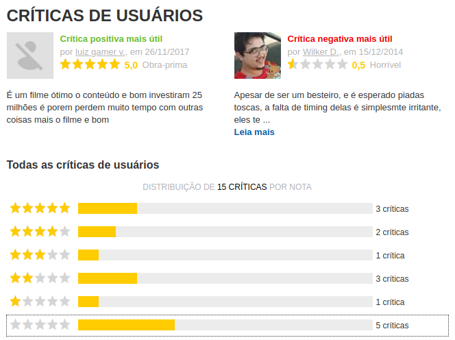
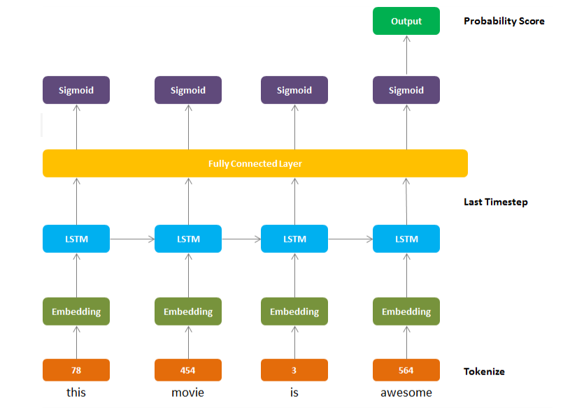

# A Ideia

## Contexto

Um dos elementos mais importantes para as empresas é o contato com sua base de clientes. É vital que essas empresas saibam exatamente o que os consumidores ou clientes pensam sobre produtos ou serviços novos e estabelecidos, iniciativas recentes e ofertas de serviço ao cliente. A análise de sentimentos é uma maneira de realizar essa tarefa necessária e essa análise é um campo do Processamento de Linguagem Natural (PNL) que cria modelos que tentam identificar e classificar atributos da expressão, por exemplo:

- **Polaridade**: se o falante expressar uma opinião positiva ou negativa,
- **Assunto**: o que está sendo falado,
- **Detentor de opinião**: a pessoa ou entidade que expressa a opinião.

A Análise de sentimentos pode ajudar a transformar automaticamente as informações não estruturadas em dados estruturados de opiniões públicas sobre produtos, serviços, marcas, políticas ou qualquer outro tópico sobre o qual as pessoas possam expressar opiniões. Esses dados podem ser muito úteis para aplicativos comerciais, como análise de marketing, relações públicas, análises de produtos, pontuação de promotor líquido, feedback do produto e atendimento ao cliente.

## Solução

A entrada X é um pedaço de texto e a saída Y é o sentimento que queremos prever, como a classificação por estrela de uma crítica de cinema.

Então, iremos implementar um modelo de Deep Learning que pode classificar as críticas do IMDB como positivas ou negativas. O modelo terá uma revisão completa como entrada (palavra após palavra) e fornecerá classificações percentuais para verificar se a revisão transmite um sentimento positivo ou negativo. Aqui estão 5 exemplos de análises do conjunto de dados que, no final do artigo, serão classificados pelo modelo:

> "The film is a hoot and is just as good if not better than much of what s on saturday morning tv, especially the pseudo educational stuff we all can’t stand.” 
 
> "The things this movie tries to get the audience to buy just won’t fly with most intelligent viewers.”

> "Although life or something like it is very much in the mold of feel good movies, the cast and director stephen herek’s polished direction pour delightfully piquant wine from aged bottles.”
 
> "This is the case of a pregnant premise being wasted by a script that takes few chances and manages to insult the intelligence of everyone in the audience.”
 
> "One of the finest most humane and important holocaust movies ever made."

### Redes Neurais Recorrentes (RNNs)

As RNNs utilizam informações sequenciais, como texto. Em uma rede neural feedforward “tradicional”, assumimos que todas as entradas são independentes uma da outra, mas para muitas tarefas é uma péssima ideia. Uma frase, por exemplo, tem uma estrutura gramatical clara e ordenada, onde cada palavra depende da palavra anterior. Se você deseja que sua rede neural aprenda o significado (ou sentimento no nosso caso), a rede deve saber quais palavras vieram em que ordem.
As RNNs são chamadas de recorrentes porque executam a mesma tarefa para cada elemento de uma sequência, com a saída dependente dos cálculos anteriores. Outra maneira de pensar sobre as RNNs é que elas possuem uma "memória" que captura informações sobre o que foi calculado até o momento.

#### LSTM

As redes de memória de longo prazo - geralmente chamadas de “LSTMs” - são um tipo especial de RNN, capaz de aprender dependências de longo prazo. Os LSTMs não possuem uma arquitetura fundamentalmente diferente das RNNs, mas incorporam componentes adicionais.

    0. A primeira etapa é a de Tokenize, que não é uma camada para a rede LSTM, mas sim uma etapa
    obrigatória da conversão de nossas palavras em tokens (números inteiros).
    1. Embedding Layer: Converte nossos tokens de palavras (números inteiros)
    em incorporação de tamanho específico
    2. LSTM Layer: Definida por dims de estado oculto e número de camadas
    3. Fully Conected Layer: Mapeia a saída da camada LSTM para o tamanho de saída desejado
    4. Sigmoid Activation Layer: Transforma todos os valores de saída em um valor entre 0 e 1 
    5. Saída: A saída sigmoide do último timestep é considerada a saída final desta rede

## Benefícios

Atualmente, a análise de sentimentos é um tópico de grande interesse e desenvolvimento, pois possui muitas aplicações práticas. Como as informações públicas e privadas disponíveis na Internet estão em constante crescimento, um grande número de textos que expressam opiniões estão disponíveis em sites de revisão, fóruns, blogs e mídias sociais. Com a ajuda dos sistemas de análise de sentimentos, essas informações não estruturadas podem ser automaticamente transformadas em dados estruturados de opiniões públicas sobre produtos, serviços, marcas, política ou qualquer tópico sobre o qual as pessoas possam expressar opiniões. Esses dados podem ser muito úteis para aplicativos comerciais, como análise de marketing, relações públicas, análises de produtos, pontuação de promotor líquido, feedback do produto e atendimento ao cliente.

Estima-se que 80% dos dados do mundo não sejam estruturados e não sejam organizados de maneira predefinida. A maior parte disso vem de dados de texto, como e-mails, tickets de suporte, bate-papos, mídias sociais, pesquisas, artigos e documentos. Esses textos geralmente são difíceis, demorados e caros para analisar, entender e classificar. Os sistemas de análise de sentimentos permitem que as empresas compreendam esse mar de texto não estruturado automatizando processos de negócios, obtendo insights acionáveis e economizando horas de processamento manual de dados, em outras palavras, tornando as equipes mais eficientes.

Algumas das vantagens da análise de sentimentos incluem o seguinte:
- **Escalabilidade**: Você pode imaginar a classificação manual de milhares de tweets, conversas sobre suporte ao cliente ou análises de clientes? Existem dados demais para processar manualmente. A análise de sentimentos permite processar dados em escala de maneira eficiente e econômica
- **Análise em tempo real**: Podemos usar a análise de sentimentos para identificar informações críticas que permitem a percepção situacional durante cenários específicos em tempo real. Existe uma crise de relações públicas nas mídias sociais prestes a estourar? Um cliente irritado que está prestes a agitar? Um sistema de análise de sentimentos pode ajudá-lo a identificar imediatamente esses tipos de situações e tomar medidas.
- **Critérios consistentes**: Os humanos não seguem critérios claros para avaliar o sentimento de um pedaço de texto. Estima-se que pessoas diferentes concordam apenas entre 60 e 65% das vezes ao julgar o sentimento por um determinado pedaço de texto. É uma tarefa subjetiva que é fortemente influenciada por experiências, pensamentos e crenças pessoais. Ao usar um sistema centralizado de análise de sentimentos, as empresas podem aplicar o mesmo critério a todos os seus dados. Isso ajuda a reduzir erros e melhorar a consistência dos dados.